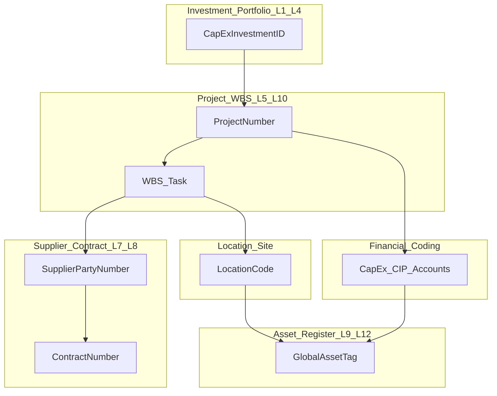

# CapEx Master Data Management Framework

> **Type:** Cross-domain MDM framework (not a domain bundle)  
> **Parent architecture:** [Finance & Accounting Domain Governance Architecture](finance-accounting-domain-governance-architecture.md)  
> **Process companion:** [CapEx Lifecycle Governance Overlay](capex-lifecycle-governance-overlay.md)  
> **Domain bundles referenced:** [Procurement](../packages/oracle-fusion-procurement-26b/), [AP I2P](../packages/oracle-fusion-ap-i2p-26b/), [Projects](../packages/oracle-fusion-project-management-26b/), [Fixed Assets](../packages/oracle-fusion-fixed-assets-26b/), [General Ledger](../packages/oracle-fusion-general-ledger-26b/)

---

## 0) Framework Inputs

| Item | Value |
|---|---|
| Business function | End-to-end CapEx lifecycle master data from strategy through retirement |
| Platform | Oracle Fusion Cloud 26B; optional Oracle Cloud EPM Planning; optional external PPM (Planview, Clarity, ServiceNow SPM) |
| Governance objective | Establish trusted, traceable, and controlled CapEx master data with clear ownership, identifiers, quality rules, and lineage across domain boundaries |
| Primary audience | Enterprise data architect, CapEx process owner, domain data owners and stewards, Controllership, PMO, CPO, Asset Accounting Manager, IT ERP / integration leads |
| Reference standards | DAMA-DMBOK (data governance, reference/master data, quality, metadata, integration); COSO internal control alignment |
| Maturity (current → target) | Foundational → Defined (12-month horizon; aligned to CapEx overlay) |
| Tone | DAMA-DMBOK aligned; mandatory verbs (`shall`, `must`) reserved for policy and control statements |
| Non-goals | Replace domain `02-governed-data-and-analytics.md` files; Oracle FSM/MDM Cloud product configuration; tenant-specific segment values (marked TBD) |

---

## 1) Executive Summary

**Context.** CapEx master data is created upstream of Oracle execution—often in portfolio tools, intake registers, or EPM Planning—and then flows through Projects, Procurement, Payables, Fixed Assets, and General Ledger. Each domain bundle governs in-domain data quality, but **cross-domain golden keys, reference data, and identifier continuity** are not yet enterprise-standard. Process handoffs (H-01–H-06 in the CapEx overlay) fail when master data is incomplete, duplicated, or untraceable.

**What this framework does.** It defines the **data architecture layer** for CapEx: twelve lifecycle stages mapped to master-data objects; target-state MDM model; golden-record authority; six data domains; ten enterprise data-quality rules; governance forums; failure-mode catalog; and phased implementation. Domain glossaries and DQ catalogs remain authoritative within each bundle.

**What is ready.** Stage-to-object mapping; identifier policy; golden-record authority matrix; MDQ-01 through MDQ-10; cross-domain RACI; conceptual domain map; integration patterns A/B/C for upstream portfolio authoring.

**What remains.** Tenant-specific segment values, approval thresholds, automation of MDQ checks, and selection of upstream portfolio pattern(s).

**What we ask of leadership.**
1. Endorse the MDM policy rules in §2.
2. Confirm the CapEx MDM Council and Data Steward Working Group (§7).
3. Approve identifier policy and golden-record authority matrix (§3).

---

## 2) MDM Policy Addendum

### 2.1 Purpose
Establish mandatory requirements for CapEx master data creation, maintenance, quality, lineage, and cross-domain synchronization.

### 2.2 Scope
- In scope: investment and portfolio objects (L1–L4); project and WBS; financial coding; supplier and contract reference data; location and site; asset register; cross-reference identifiers; enterprise CapEx DQ rules MDQ-01 through MDQ-10.
- Out of scope: Detailed domain analytics SOPs; full enterprise non-CapEx MDM; maintenance work-order master data beyond operational handoff reference.

### 2.3 Policy Rules (mandatory)
1. **MDM-1 System of record.** Each master-data object shall have one authoritative system of record per the golden-record authority matrix (§3.2).
2. **MDM-2 Global identifiers.** CapEx objects shall carry approved global identifiers (`CapExInvestmentID`, `ProjectNumber`, `GlobalAssetTag`, `SupplierPartyNumber`, `LocationCode`) and cross-references where systems differ.
3. **MDM-3 Stewardship.** Every governed object shall have a named data owner and steward before production use.
4. **MDM-4 Reference data control.** Reference data (asset categories, CapEx account ranges, purchasing categories, location hierarchy) shall change only through approved change control (§3.8).
5. **MDM-5 Enterprise DQ.** CapEx transactions shall meet MDQ-01 through MDQ-10 thresholds; failures shall block downstream processing where systemically enforceable.
6. **MDM-6 Lineage.** Gold CapEx reports and funnel metrics shall publish source-to-consumption lineage including master-data dependencies.
7. **MDM-7 Duplicate prevention.** Duplicate suppliers, projects, and asset tags shall be prevented or remediated per §3.7 before capitalization.
8. **MDM-8 Audit trail.** Material changes to golden attributes shall retain field-level audit, approver identity, and effective date.
9. **MDM-9 Cross-domain issues.** Master-data failures spanning domains shall route through the CapEx overlay issue workflow (overlay §7) with MDQ reference.
10. **MDM-10 Review cadence.** This framework shall be reviewed annually or upon material system, process, or regulatory change.

---

## 3) Target-State MDM Model (DAMA-DMBOK Aligned)

### 3.1 Capability summary

| DAMA capability | CapEx target-state design |
|---|---|
| **Canonical definitions** | Enterprise CapEx glossary (§3.9) extending overlay §8.1; cross-refs to domain glossaries |
| **Global identifiers** | `CapExInvestmentID`, `ProjectNumber`, `GlobalAssetTag`, `SupplierPartyNumber`, `LocationCode`, `ContractNumber`; external PPM cross-ref table |
| **Reference data** | Asset categories, CapEx/CIP account ranges, purchasing categories, depreciation conventions, location hierarchy, commissioning status codes |
| **Hierarchies** | Portfolio → program → project → WBS → task; LE/BU → site → FA location; UNSPSC ↔ purchasing category ↔ asset category |
| **Data lineage** | Intake → project → PO → receipt → invoice → FA source → GL journal → OTBI/OAC CapEx funnel |
| **Integration patterns** | System-of-record per domain; publish/subscribe for reference data; event validation at H-01–H-06 |
| **Duplicate prevention** | Supplier fuzzy match; project/WBS duplicate check; asset tag uniqueness; invoice-line capitalization uniqueness |
| **Change control** | MDM change request → steward → domain forum → CapEx MDM Council for cross-domain impact |
| **Auditability** | Field audit, approval history, lineage version, issue register linkage |

### 3.2 Golden-record authority matrix

| Master-data object | System of record | Conflict resolution | Cross-ref required |
|---|---|---|---|
| Investment theme / portfolio bucket | Pattern A: EPM Planning · B: External PPM · C: Intake register | CapEx MDM Council | `CapExInvestmentID` |
| Demand request / business case | Same as L1–L4 pattern | Investment & Portfolio Forum | `CapExInvestmentID` |
| Approved investment / funding envelope | Same as L1–L4 pattern | CapEx committee | `CapExInvestmentID` |
| Project / WBS / task | Oracle Project Management | Project owner | `ProjectNumber` + external ID |
| Budget version | Pattern A: EPM · B/C: Oracle Projects / GL | Controllership | Budget version ID |
| COA segments (CapEx/CIP accounts) | Oracle General Ledger | GL owner | Segment value set |
| Supplier / site | Oracle Supplier Model | Supplier MDM Steward | `SupplierPartyNumber` |
| Contract / BPA | Oracle Procurement Contracts | Contracts Manager | `ContractNumber` |
| Item / catalog | Oracle Item master | Catalog Steward | Item number |
| PO / receipt / invoice | Oracle Procurement / Payables | Domain process owner | Transaction ID |
| FA book / category / location | Oracle Assets setup | Asset Accounting Manager | Book code, category, `LocationCode` |
| Asset register / tag | Oracle Assets | Asset Accounting Manager | `GlobalAssetTag` |
| Commissioning / PIS record | Oracle Assets (+ document store) | Asset Accountant | Linked to `GlobalAssetTag` |
| Retirement record | Oracle Assets | Asset Accounting Manager | `GlobalAssetTag` |

### 3.3 Global identifier policy

| Identifier | Format (tenant TBD) | Assigned at | Immutable | Carried on |
|---|---|---|---|---|
| `CapExInvestmentID` | `CXP-YYYY-NNNNN` | L2 demand intake | Yes | All downstream objects |
| `ProjectNumber` | Oracle project number | L5 budgeting | Yes | Req, PO, invoice, costs, FA source |
| `GlobalAssetTag` | `AST-LE-NNNNNN` | L9 capitalization (or L6 template) | Yes | FA register, GL, reports |
| `SupplierPartyNumber` | Oracle party number | Supplier registration | Yes | PO, invoice, contract |
| `LocationCode` | Enterprise location code | L6 design / FA setup | No (controlled change) | Project, FA, receiving |

**Cross-reference table** (required for pattern B): maps `CapExInvestmentID` ↔ external PPM ID ↔ `ProjectNumber` ↔ `GlobalAssetTag`.

### 3.4 Hierarchies

```text
Portfolio
 └── Program
      └── Project (ProjectNumber)
           └── WBS / Work plan
                └── Task
                     └── Expenditure item / cost line

Legal Entity
 └── Business Unit
      └── Site
           └── FA Location (LocationCode)

UNSPSC
 └── Purchasing Category
      └── Asset Category (capitalization mapping)
```

### 3.5 Integration patterns

| Pattern | Upstream (L1–L4) | Integration mechanism | Validation gate |
|---|---|---|---|
| **A — EPM Planning** | Budget dimensions, capital categories | REST / BICC → project and budget load | MDQ-10; L4→L5 |
| **B — External PPM** | Investment ID, business case, gate decisions | Middleware → Oracle project create/update | Cross-ref table; MDQ-10 |
| **C — Oracle-only** | Governed intake register (controlled spreadsheet or FSM extension) | FBDI / manual project create | Intake ID on project DFF; MDQ-10 |

**Downstream integration (L5–L12):** Native Oracle Fusion workflows; OTBI/OAC for analytics; optional OAC data flows for MDQ monitoring.

### 3.6 Data lineage (conceptual)

```mermaid
flowchart LR
  Intake[CapExInvestmentID] --> Project[ProjectNumber]
  Project --> Req[Requisition]
  Req --> PO[PurchaseOrder]
  PO --> Rcpt[Receipt]
  Rcpt --> Inv[Invoice]
  Inv --> CIP[CIP_Accumulation]
  CIP --> FASrc[FA_Source_Line]
  FASrc --> Asset[GlobalAssetTag]
  Asset --> GL[GL_Journal]
  GL --> Rpt[CapEx_Funnel_Report]
```



### 3.7 Duplicate prevention controls

| Object | Control | Domain ref | Enforcement |
|---|---|---|---|
| Supplier | Fuzzy match on name + tax ID + address | Procurement DQ-10 | Block PO to duplicate candidate |
| Project | Name + org + WBS structure match | MDM steward review | Block project create if duplicate |
| Asset tag | Unique `GlobalAssetTag` per physical asset | MDQ-09 | Block FA mass addition post |
| Invoice line | One capitalization target per eligible line | MDQ-06 | AP hold + FA source reject |
| Investment | Unique `CapExInvestmentID` | MDQ-10 | Intake register validation |

### 3.8 Change control workflow

1. **Request** — Steward or process owner submits MDM change request (object, attribute, rationale, downstream impact).
2. **Assess** — Enterprise data architect assesses cross-domain impact and lineage.
3. **Approve** — Domain forum for single-domain; CapEx MDM Council for cross-domain reference data.
4. **Implement** — Technical custodian applies in system of record; publish to subscribers.
5. **Verify** — MDQ re-run; update lineage and glossary; close issue if remediation.

### 3.9 Enterprise CapEx glossary (minimum)

| Term | Definition | Owner | Domain glossary ref |
|---|---|---|---|
| CapExInvestmentID | Enterprise identifier for an approved capital investment from intake through retirement | CapEx process owner | — |
| CapEx spend | Approved capital expenditure posted or committed per capitalization policy | Controllership | Overlay §8.1 |
| CIP balance | Costs accumulated before place in service | Asset Accounting Manager | FA §6 |
| Place in service (PIS) | Date asset is available for intended use; depreciation trigger | Asset Accounting Manager | FA §6; overlay §8.1 |
| GlobalAssetTag | Enterprise unique physical asset identifier in FA register | Asset Accounting Manager | — |
| ProjectNumber | Oracle authoritative project identifier | Project Executive | Projects §6 |
| Qualified Supplier | Supplier meeting qualification requirements for category | Supplier Risk Lead | Procurement §6 |
| CapEx account | GL account designated for capital expenditure per policy | GL owner | GL §6 |
| LocationCode | Enterprise site/location code used on project and FA records | Asset Accounting Manager | FA DQ-02 |

---

## 4) Twelve-Stage Lifecycle × Master-Data Mapping

### 4.1 Stage map to process overlay

| MDM stage | Process overlay | Handoffs |
|---|---|---|
| L1 Strategy | Upstream of S1 | — |
| L2 Demand intake | Upstream of S1 | — |
| L3 Feasibility | Upstream of S1 | — |
| L4 Authorization | Feeds S1 | → L5 (H-01 precursor) |
| L5 Budgeting | S1 | H-01 |
| L6 Design | S1 | H-01, H-02 |
| L7 Sourcing | S2 | H-02 |
| L8 Construction / implementation | S3, S4 | H-03, H-04 |
| L9 Capitalization | S5 | H-04, H-05, H-06 |
| L10 Commissioning | S5 extension | H-06 |
| L11 Operational handoff | S5–S6 | H-05 |
| L12 Retirement | S6 | — |

### 4.2 Upstream portfolio patterns (L1–L4)

| Pattern | Authoritative source | Integration to Oracle Projects |
|---|---|---|
| A — EPM Planning | Oracle Cloud EPM Planning | REST/BICC → project/budget load |
| B — External PPM | Planview / Clarity / ServiceNow SPM | Middleware → project create with global ID cross-ref |
| C — Oracle-only | Governed CapEx intake register | Manual or FBDI project creation with intake ID |

### 4.3 Stage-by-stage master-data register

| Stage | MD objects (create / consume / update) | Data owner | Steward | Source system | Downstream consumers | DQ controls | Approval rules | Lifecycle status | Common failure modes |
|---|---|---|---|---|---|---|---|---|---|
| **L1 Strategy** | Investment theme, portfolio bucket, capital policy thresholds (C/U) | CFO / CapEx committee delegate | CapEx process owner | EPM / PPM / strategy register | L2–L4 forums, EPM | MDQ-10 prep | Committee approval | Draft → Approved → Active → Retired | Themes without funding link; thresholds not synced to COA |
| **L2 Demand intake** | Demand request, business case, preliminary CapEx/Opex class (C) | Business unit leader | Portfolio steward | Intake register / PPM | L3–L4, project planning | MDQ-02 prep; MDQ-10 | BU + finance review | Draft → Submitted → Approved → Rejected | Missing classification; duplicate requests |
| **L3 Feasibility** | Feasibility study, options analysis, risk register (C/U) | Project sponsor | PMO steward | PPM / document store | L4 authorization | Completeness of options | Stage-gate reviewer | In progress → Complete | Options not costed; risks not linked to budget |
| **L4 Authorization** | Investment decision, funding envelope, `CapExInvestmentID` (C) | CapEx committee | CapEx process owner | Committee minutes / PPM / EPM | L5 project create | MDQ-10 | Formal authorization | Proposed → Authorized → Deferred | Authorization without ID; envelope not in EPM/Projects |
| **L5 Budgeting** | Budget version, project charter, WBS shell, CapEx COA mapping (C/U) | Project Executive | Project Administrator | Oracle Projects / EPM | Procurement, GL, reporting | MDQ-01, MDQ-02, MDQ-10 | PMO + finance approval | Draft → Approved → Baseline frozen | Project without `CapExInvestmentID`; wrong account range |
| **L6 Design** | Detailed WBS, tasks, asset template, `LocationCode` (C/U) | Project Manager | Project Administrator | Oracle Projects | Procurement, FA | MDQ-01; FA DQ-02 prep | PM + asset accounting consult | Active → Change controlled | WBS not aligned to deliverables; location TBD at req |
| **L7 Sourcing** | Supplier, contract/BPA, item, purchasing category (C/U) | Procurement Ops Mgr | Supplier MDM / P2P steward | Oracle Procurement | AP, receiving | MDQ-03, MDQ-04; Proc DQ-01–10 | Sourcing + contract approval | Supplier: Prospect → Qualified → Active | Duplicate vendor; off-contract CapEx; wrong category |
| **L8 Construction** | PO, receipt, project actuals, CIP (C/U) | Procurement / PM | P2P steward / Project Accountant | Procurement, Projects, AP | FA, GL, funnel metrics | MDQ-01, MDQ-04, MDQ-05 | PO/receipt approvals | PO: Open → Received → Closed | Missing project on PO; receipt without location; CIP orphan costs |
| **L9 Capitalization** | FA source lines, book/category, PIS, useful life, `GlobalAssetTag` (C) | Asset Acct Mgr | Asset Accountant | Oracle Assets | GL, tax, insurance, reports | MDQ-06–09; FA DQ-02 | Asset accounting approval | Source → Queued → Posted | Double capitalize; wrong book; PIS before costs complete |
| **L10 Commissioning** | Commissioning cert, acceptance test (C/U) | Project Manager | Asset Accountant | Document store + FA | L11 handoff | MDQ-08 | PM + operations signoff | Pending → Accepted | PIS before acceptance; missing cert |
| **L11 Operational handoff** | Operating asset, custodian, maint. class ref (U) | Operations / FA | Asset Accountant | FA + EAM ref (if used) | Maintenance, insurance | MDQ-07; MDQ-09 | Operations acceptance | In service → Operating | Asset not in physical inventory; wrong custodian |
| **L12 Retirement** | Retirement/disposal, gain/loss link (U/C) | Asset Acct Mgr | Asset Accountant | Oracle Assets | GL, audit | FA recon; MDQ-09 | Retirement approval | Active → Retired → Disposed | Retire without clearing NBV; orphan tag reused |

*C = create, U = update*

---

## 5) Conceptual Data-Domain Map

### 5.1 Six CapEx MD domains

| Domain | Scope (stages) | System of record | Domain bundle |
|---|---|---|---|
| **Investment & Portfolio** | L1–L4 | EPM / PPM / intake register | Overlay + §4.2 patterns |
| **Project & WBS** | L5–L8, L10 | Oracle Project Management | [Projects 02](../packages/oracle-fusion-project-management-26b/02-governed-data-and-analytics.md) |
| **Financial Coding** | L5–L12 | Oracle GL | [GL 02](../packages/oracle-fusion-general-ledger-26b/02-governed-data-and-analytics.md) |
| **Supplier & Contract** | L7–L8 | Oracle Procurement | [Procurement 02](../packages/oracle-fusion-procurement-26b/02-governed-data-and-analytics.md) |
| **Location & Site** | L6–L11 | FA location + inv org (reference) | [FA 02](../packages/oracle-fusion-fixed-assets-26b/02-governed-data-and-analytics.md) |
| **Asset Register** | L9–L12 | Oracle Assets | [FA 02](../packages/oracle-fusion-fixed-assets-26b/02-governed-data-and-analytics.md) |

### 5.2 Bounded-context relationships



---

## 6) Cross-Domain MDM RACI

### 6.1 Roles

| Role | Accountability |
|---|---|
| CapEx MDM Council Chair | CapEx process owner |
| Enterprise data architect | Target model, identifiers, integration standards |
| Domain data owner | Per §5.1 (e.g., Procurement Ops Mgr for Supplier) |
| Domain steward | Per domain `02` assignments |
| Technical custodian | Oracle ERP / BI / integration leads |

### 6.2 RACI matrix

| Activity | CapEx process owner | Enterprise DA | Investment steward | Project steward | Supplier MDM | Asset steward | GL owner | IT custodian |
|---|---|---|---|---|---|---|---|---|
| Golden record definition | A | R | C | C | C | C | C | I |
| Identifier policy | A | R | C | C | C | C | C | C |
| Create investment ID | C | I | **R/A** | I | I | I | C | I |
| Create / update project WBS | C | C | C | **R/A** | I | C | C | C |
| Maintain supplier master | I | I | I | I | **R/A** | I | I | C |
| Maintain asset register | C | I | I | C | I | **R/A** | C | C |
| Maintain COA reference | C | C | I | I | I | C | **R/A** | C |
| MDQ monitoring | A | C | R | R | R | R | R | **R** |
| MD issue remediation | A | C | R | R | R | R | R | C |
| Cross-domain MD change | **A** | R | C | C | C | C | C | C |

*R = Responsible, A = Accountable, C = Consulted, I = Informed*

---

## 7) Ten Essential Enterprise DQ Rules (MDQ)

| ID | Rule | Dimension | Threshold | Monitor | Escalation owner | Links |
|---|---|---|---|---|---|---|
| MDQ-01 | Every CapEx transaction carries valid `ProjectNumber` + task | Completeness / validity | 100% | Req/PO/invoice validation | P2P steward | CXC-02; H-01, H-02 |
| MDQ-02 | CapEx account segment matches capitalization policy | Validity | 100% | GL combo edit | Controllership | CXC-01 |
| MDQ-03 | CapEx PO supplier is qualified and not duplicate | Validity / uniqueness | 100% | Supplier status + DQ-10 | Supplier MDM steward | Procurement DQ-01, DQ-10 |
| MDQ-04 | PO charge account passes GL CapEx/CIP validation | Validity | 100% | GL combo edit | Procurement Ops Mgr | Procurement DQ-06 |
| MDQ-05 | Receipt exists before CapEx invoice match | Consistency | 100% | Match report | AP Manager | CXC-03; H-03 |
| MDQ-06 | Invoice line maps to one capitalization target | Uniqueness | 100% | AP hold + FA source | Asset Accountant | H-04 |
| MDQ-07 | FA source line has book, category, location | Completeness | 100% | Mass additions review | Asset Accountant | FA DQ-02 |
| MDQ-08 | PIS date ≥ last cost date; useful life approved | Validity / consistency | 100% | PIS approval check | Asset Acct Mgr | CXC-06 |
| MDQ-09 | One physical asset → one `GlobalAssetTag` | Uniqueness | 100% | Tag + invoice cross-check | Asset Acct Mgr | CXC-05 |
| MDQ-10 | `CapExInvestmentID` traceable L1–L12 | Lineage / completeness | 100% | Cross-ref audit | CapEx process owner | All stages |

---

## 8) Governance Forums

| Forum | Mandate | Chair | Cadence | Relationship |
|---|---|---|---|---|
| **CapEx MDM Council** | Approve golden definitions, identifier policy, MDQ thresholds, cross-domain changes | CapEx process owner | Monthly | Tactical tier; pairs with CapEx governance board |
| **CapEx Data Steward Working Group** | Triage MD issues, glossary updates, cross-ref maintenance | Enterprise data architect | Bi-weekly | Feeds domain steward forums |
| **Investment & Portfolio Forum** | L1–L4 reference data; patterns A/B/C selection | CFO delegate | Quarterly | Strategic tier input |
| Procurement Data Governance Council | Supplier, category, contract MD | CPO / Analytics Lead | Monthly | [Procurement 02 §3](../packages/oracle-fusion-procurement-26b/02-governed-data-and-analytics.md) |
| Project Analytics Review Forum | Project, WBS, performance MD | PMO / Project Executive | Monthly | [Projects 02 §3](../packages/oracle-fusion-project-management-26b/02-governed-data-and-analytics.md) |
| Assets Analytics Review Forum | Asset, location, depreciation MD | Asset Accounting Manager | Monthly | [FA 02 §3](../packages/oracle-fusion-fixed-assets-26b/02-governed-data-and-analytics.md) |
| GL Analytics Review Forum | COA, journal, balance MD | General Accounting Manager | Monthly | [GL 02 §3](../packages/oracle-fusion-general-ledger-26b/02-governed-data-and-analytics.md) |

---

## 9) Failure-Mode Catalog and Business Impact

| Poor MD area | Symptom | Root cause (typical) | Business impact |
|---|---|---|---|
| **Project / WBS** | Duplicate project codes; missing task on requisition | No MDQ-01; weak intake→project link | Budget leakage; unreliable forecast; maverick spend |
| **Asset** | Same invoice capitalized twice | No MDQ-06/09 | Duplicate assets; overstated NBV; audit finding |
| **Vendor** | Duplicate or unqualified supplier on CapEx PO | DQ-10 not run; bypass qualification | Procurement errors; payment fraud risk; contract non-compliance |
| **Location** | Missing FA location at capitalization | L6 design gap; FA DQ-02 fail | Weak asset tracking; insurance/tax jurisdiction errors |
| **Financial coding** | Opex account on CapEx PO | MDQ-02 not enforced at req | Expense misclassification; distorted P&L; SOX issue |
| **Timing** | CIP not cleared after PIS | MDQ-08 fail; H-06 breach | Delayed depreciation; inflated CIP; weak close |
| **Portfolio ID** | `CapExInvestmentID` not on project | Pattern B/C break; MDQ-10 fail | Weak ROI tracking; unreliable executive reporting |
| **Receipt / match** | Invoice before receipt | MDQ-05 fail | Payment without delivery; control failure |
| **Category mapping** | Purchasing category ≠ asset category | Hierarchy break | Wrong useful life; capitalization errors |
| **Budget** | Spend against unapproved project | L4→L5 gate skip | Unauthorized capital spend; committee bypass |

---

## 10) Phased Implementation Plan

| Phase | Weeks | MDM deliverables | Risk mitigation |
|---|---|---|---|
| **0 — Mobilize** | 1–4 | MDM charter; identifier policy; golden-record matrix; council charter | Scope creep — limit to top 3 asset categories |
| **1 — Model** | 5–10 | Validate §4.3 stage map; glossary v1; cross-ref design for patterns A/B/C; steward assignments | Analysis paralysis — time-box pattern selection |
| **2 — Enforce** | 11–20 | MDQ-01–07 in Oracle (holds, combos, validations); duplicate prevention jobs | User workarounds — executive mandate + issue logging |
| **3 — Integrate** | 21–28 | Lineage published; CapEx funnel + MD quality dashboard; steward training | Report distrust — certify against native sources first |
| **4 — Sustain** | Ongoing | Monthly MDM Council; quarterly MD health scorecard; release impact on reference data | Control decay — tie to close calendar and CXM metrics |

### Skills and hiring

| Need | Source | Priority |
|---|---|---|
| Supplier MDM steward | Existing Procurement forum | Required |
| Project data steward | PMO / Project Administrator | Required |
| Asset MD steward | Asset Accountant | Required |
| Integration architect (pattern B) | Hire or contract if external PPM | Conditional |
| MDQ automation (OAC/BICC) | BI / IT Financials lead | Phase 2–3 |

---

## 11) Prioritized Recommendations

1. **Publish `CapExInvestmentID` → `ProjectNumber` cross-reference** as mandatory at L4→L5 authorization; enforce MDQ-10 before project baseline approval.
2. **Enforce MDQ-01 and MDQ-02 at requisition** via Oracle segment rules and GL combo validation — system block, not post-hoc audit.
3. **Stand up CapEx Data Steward Working Group** before automating DQ; stewards own issue triage and glossary.
4. **Implement MDQ-09 at FA mass-additions review** — duplicate-asset prevention is the highest-value close risk reducer.
5. **Publish lineage for CapEx funnel metrics (CXM-01–07)** including MD quality dimensions and MDQ pass rates.

---

## 12) Document Control and Traceability

| Field | Value |
|---|---|
| Document title | CapEx Master Data Management Framework |
| Version | 1.0 Draft |
| Status | Draft reference framework |
| Owner | CapEx process owner + enterprise data architect (to be assigned) |
| Approval authority | CapEx MDM Council / Finance Data Governance Council |
| Effective date | To be assigned at approval |
| Review cadence | Annual or upon material system, process, or regulatory change |
| Related process overlay | [CapEx Lifecycle Governance Overlay](capex-lifecycle-governance-overlay.md) |
| Related architecture | [Finance & Accounting Domain Governance Architecture](finance-accounting-domain-governance-architecture.md) |
| Domain data bundles | Procurement, AP I2P, Projects, Fixed Assets, General Ledger `02-governed-data-and-analytics.md` |
