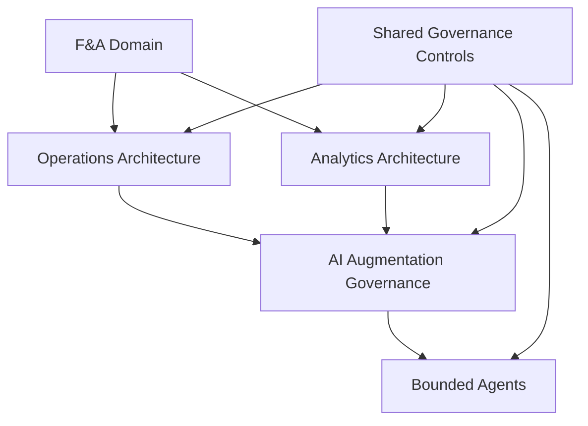

# Finance & Accounting Domain Governance Architecture

## Purpose

This guide defines a reusable governance architecture for Finance & Accounting (F&A) domains. It establishes how domain operations, analytics, AI augmentation, and bounded agents fit together without confusing process ownership, data trust, control evidence, and automation authority.

AP Invoice-to-Pay is the first worked example because it is control-heavy, evidence-rich, exception-prone, and data-sensitive. Receivables Credit to Cash, Procurement, General Ledger, Projects, Fixed Assets, and Oracle Cloud EPM Financial Consolidation and Close are now also represented as domain bundles in this repository. The architecture is domain-agnostic and can be applied to AR, GL, Record to Report / Close, FP&A, Payroll, Tax, Treasury, Fixed Assets, Procurement, Revenue, and Audit Support.

## Core Principle

AI and agents inherit constraints from governed operations and governed analytics.

Agents are assigned only to bounded tasks inside a governed domain architecture. They are not designed against a finance function in the abstract, and they do not create their own process authority, data authority, or control evidence.

## Architecture Model

## Layer 1: F&A Domain

The F&A domain is the governed business context. It defines the business function, process scope, accountable leadership, risk profile, regulatory exposure, and management decisions supported.

Examples include AP, AR, GL, Record to Report / Close, FP&A, Payroll, Tax, Treasury, Fixed Assets, Procurement, Revenue, and Audit Support.

Each domain must identify:
- Business purpose and process scope.
- Accountable owner and governance sponsor.
- Systems of record and authoritative data sources.
- Key decisions, controls, reports, metrics, and compliance obligations.
- Sensitive data and restricted activities.
- Documentation, evidence, and review expectations.

## Layer 2: Operations Architecture

Operations Architecture defines how work is performed and controlled. It is the foundation for process accountability.

It answers:
- What process is being governed?
- Who owns the process?
- What are the stages, handoffs, and control gates?
- What evidence proves execution?
- What exceptions and escalations exist?
- What authority cannot be delegated?

Required components:
- Process scope and out-of-scope boundaries.
- Process stages and trigger-to-endpoint flow.
- Roles, responsibilities, RACI, and decision rights.
- Control points, control owners, performers, and reviewers.
- Exception handling, issue routing, and escalation.
- Evidence artifacts, retention, and review cadence.
- Operating metrics and governance review rhythm.

For AP, this layer is represented by [`01-controlled-operations.md`](../packages/oracle-fusion-ap-i2p-26b/01-controlled-operations.md).

## Layer 3: Analytics Architecture

Analytics Architecture defines how trusted information is produced, governed, extended, and used for decisions. It does not replace the operating process or system of record.

It answers:
- What native reporting exists first?
- What sources are authoritative?
- Which metrics, definitions, grain, and thresholds are approved?
- What lineage and data quality controls are required?
- What analytics extensions are allowed?
- What data use boundaries apply to analytics?

Required components:
- System-of-record and native-reporting assessment.
- Approved metrics and business definitions.
- Source-to-output lineage and transformation logic.
- Data quality rules, thresholds, and remediation paths.
- Access, extract, sharing, and retention controls.
- Analytics extension intake and approval path.
- Change control for reports, metrics, models, extracts, and dashboards.

For AP, this layer is represented by [`02-governed-data-and-analytics.md`](../packages/oracle-fusion-ap-i2p-26b/02-governed-data-and-analytics.md) and [`analytics-intake-and-extension-policy.md`](../policies/analytics-intake-and-extension-policy.md).

## Layer 4: AI Augmentation Governance

AI Augmentation Governance defines where AI may assist and how it must be controlled. It depends on Operations Architecture and Analytics Architecture being sufficiently defined.

It answers:
- Where may AI assist?
- What use is permitted, restricted, high-risk, agentic, or prohibited?
- What data may AI access or use?
- What human review is required?
- What evidence must be retained?
- What monitoring and recertification are required?

Required components:
- AI safe-use categories.
- AI use-case intake and risk tiering.
- Data handling and disclosure rules.
- Human review and accountability requirements.
- AI risk/control mapping.
- Exception and incident handling.
- Monitoring, recertification, and change triggers.

AI should not be used to compensate for undefined operations, weak analytics lineage, unclear metrics, missing control evidence, or unresolved data ownership. In those cases, process and analytics architecture must be strengthened first.

For AP, this layer is represented by [`03-governed-ai.md`](../packages/oracle-fusion-ap-i2p-26b/03-governed-ai.md).

## Layer 5: Bounded Agents

Bounded Agents are optional capabilities. They are introduced only when readiness is met.

An agent is any AI-enabled workflow that can plan steps, call tools, access systems, retrieve data, generate work products, schedule activity, or recommend or trigger actions with partial autonomy.

Agent readiness must define:
- Repeatable tasks that may be delegated.
- Allowed inputs and outputs.
- Approved tools and access scope.
- Blocked actions.
- Required review gate.
- Logs and evidence.
- Recertification triggers.

Agents may support drafting, summarization, triage, evidence preparation, commentary, classification, monitoring, and readiness review. Agents may not approve, post, pay, certify, file, override, externalize, delete, or change controlled records unless the domain governance architecture explicitly permits the action and defines the required control environment.

## Shared Governance Controls

Shared Governance Controls apply across all layers. They are the common control backbone for domain operations, analytics, AI augmentation, and agents.

| Control | Purpose |
|---|---|
| Ownership | Names accountable owners, stewards, reviewers, and approvers |
| Intake | Captures business purpose, scope, risk, data, and routing decisions |
| Approval | Records authorized decisions, conditions, and exception authority |
| Evidence | Defines what proof must be retained and where |
| Access | Enforces least privilege, segregation of duties, and review cadence |
| Data classification | Defines sensitivity, handling, sharing, masking, and retention expectations |
| Exceptions | Records rationale, risk acceptance, compensating controls, approver, and expiration |
| Monitoring | Tracks operation, adoption, control performance, incidents, and issues |
| Lifecycle review | Revises, recertifies, retires, or refreshes artifacts when risks or processes change |

## Domain Application Sequence

Apply the architecture in this order:

1. Define the F&A domain and business objective.
2. Establish or confirm Operations Architecture.
3. Establish or confirm Analytics Architecture.
4. Identify AI augmentation opportunities only within those boundaries.
5. Classify AI use by risk tier and data sensitivity.
6. Map AI risks to controls, evidence, ownership, and monitoring.
7. Approve bounded agents only when readiness requirements are met.
8. Control documentation lifecycle, review cadence, exceptions, and recertification.

## Readiness Gates

### Operations Readiness

Do not advance to analytics or AI augmentation until:
- Process stages and ownership are defined.
- Control gates and decision rights are explicit.
- Evidence requirements are known.
- Exceptions and escalation paths exist.
- Authority that cannot be delegated is documented.

### Analytics Readiness

Do not approve custom analytics, AI-assisted analytics, or AI agents using domain data until:
- Native reporting has been assessed first.
- Source systems and authoritative data are identified.
- Metrics, grain, filters, and definitions are approved.
- Lineage and data quality controls are defined.
- Access, extract, sharing, and retention controls are in place.

### AI Augmentation Readiness

Do not approve AI use beyond low-risk productivity support until:
- Safe-use category is assigned.
- Data access/use is approved.
- Human review is defined.
- Control impact is assessed.
- Evidence retention is defined.
- Monitoring and recertification expectations are set.

### Agent Readiness

Do not approve bounded agents until:
- Agent purpose and scope are bounded.
- Inputs, outputs, tools, permissions, and blocked actions are defined.
- Human approval gates exist before material finance, accounting, compliance, external, or system-changing actions.
- Testing covers expected use, edge cases, misuse, permission limits, and recovery.
- Logs, monitoring, incident handling, and recertification are defined.

## AP as the First Worked Example

AP is a strong proving ground because:
- It is control-heavy and evidence-rich.
- It is exception-prone and data-sensitive.
- It relies on clear operating gates: invoice intake, validation, approval, payment preparation, payment execution, and post-payment review.
- It has strong analytics dependencies: native Oracle reporting, metric definitions, lineage, data quality, and governed extensions.
- It exposes AI risks clearly: supplier data, bank data, tax data, payment decisions, duplicate risk, approval evidence, and agentic action boundaries.

The AP worked example should be used to validate the architecture, improve the templates, and prove the governance sequence before applying the model to other F&A domains. The additional Receivables Credit to Cash, Procurement, General Ledger, Projects, Fixed Assets, and Financial Consolidation and Close bundles extend that proof into adjacent operational, accounting, and close domains.

## Cross-Domain Lifecycle Overlays

Some business processes span multiple F&A domains. Domain bundles remain authoritative for in-domain operations, analytics, and AI. Cross-domain overlays define stage gates, handoff data contracts, joint RACI, enterprise metrics, and issue routing without duplicating domain SOPs.

| Overlay | Domains | Document |
|---|---|---|
| CapEx lifecycle (process) | Procurement, AP, Projects, Fixed Assets, GL | [`capex-lifecycle-governance-overlay.md`](capex-lifecycle-governance-overlay.md) |
| CapEx lifecycle (master data) | Investment, Projects, Procurement, AP, FA, GL | [`capex-master-data-management-framework.md`](capex-master-data-management-framework.md) |

**EPM Planning Modules** serves as upstream Pattern A for CapEx stages L1–L5 (strategy through budgeting). The [EPM Planning governance package](../packages/oracle-cloud-epm-planning-modules/) governs the planning, budgeting, and Capital module operations that produce `CapExInvestmentID`, budget versions, and Capital plan data consumed by the overlay and MDM framework.

Apply overlays after domain Operations Architecture is documented for each participating domain.

## Reusable Domain Checklist

Use this checklist when applying the architecture to a new F&A domain:

- [ ] Domain scope and objective are defined.
- [ ] Accountable owner, sponsor, reviewers, and approvers are named.
- [ ] Operations Architecture is documented.
- [ ] Analytics Architecture is documented.
- [ ] Shared Governance Controls are applied.
- [ ] Sensitive and restricted data categories are classified.
- [ ] Native system/reporting capability is assessed before extensions.
- [ ] Approved metrics, definitions, lineage, and quality rules are documented.
- [ ] AI safe-use categories and intake routing are defined.
- [ ] AI risk/control mapping is completed for restricted, high-risk, recurring, or control-relevant use.
- [ ] Agent readiness is completed before any bounded agent is piloted.
- [ ] Monitoring, exceptions, incidents, and lifecycle review are defined.

## Document Control

| Field | Value |
|---|---|
| Document title | Finance & Accounting Domain Governance Architecture |
| Version | 1.0 Draft |
| Status | Draft reference architecture |
| Owner | Data Governance / Finance Governance owner to be assigned |
| Approval authority | Finance Data Governance Council or equivalent governance body |
| Effective date | To be assigned at approval |
| Review cadence | Annual or upon material process, analytics, AI, control, security/privacy, or regulatory change |
| Controlled copy location | To be assigned |
| Related worked examples | AP I2P, Receivables Credit to Cash, Procurement, General Ledger, Projects, Fixed Assets, Financial Consolidation and Close, EPM Planning Modules |
| Related cross-domain overlays | CapEx Lifecycle Governance Overlay, CapEx Master Data Management Framework |
